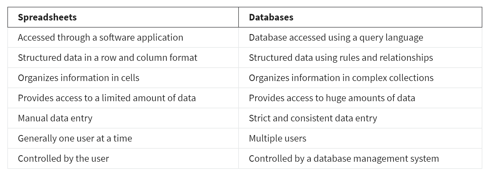

# SpreadSheets
[Excel Training](https://support.microsoft.com/en-us/office/excel-for-windows-training-9bc05390-e94c-46af-a5b3-d7c22f6990bb)

[Google Sheets Training](https://support.google.com/a/users/answer/9282959?visit_id=637361702049227170-1815413770&rd=1)

[Google Sheets Quick Tips](https://support.google.com/a/users/answer/9300022)

# Databases and query languages
A database is a collection of structured data stored in a computer system. Some popular Structured Query Language (SQL) programs include MySQL, Microsoft SQL Server, and BigQuery.

Query languages 

Allow analysts to isolate specific information from a database(s)

Make it easier for you to learn and understand the requests made to databases

Allow analysts to select, create, add, or download data from a database for analysis

# Tableau

# Look
- communicates directly with a database, allowing you to connect your data right to the visual tool you choose 

You can combine these if needed

