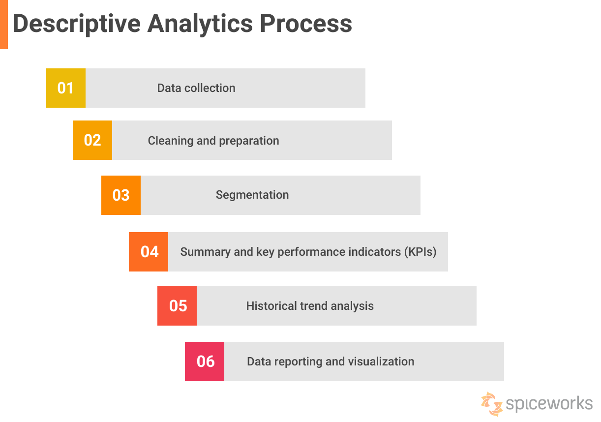

# Types of data analytics
 

## Descriptive Analytics
This type of analytics focuses on summarizing historical data to describe what has happened in the past. It involves gathering, organizing, and visualizing data to gain insights into patterns, trends, and relationships. Descriptive analytics provides a snapshot of the current state of affairs and is often used for reporting purposes.

**Answers the question**  "What happened?" or "How did it happen?"

[[Source of the image]](https://www.spiceworks.com/tech/data-management/articles/what-is-descriptive-analytics/)

**Example**

    A retail company analyzes its sales data from the past year to understand sales trends, popular products, and peak seasons. It examines metrics such as total sales revenue, sales by product category, geographic distribution of sales, and customer demographics.

    Purpose: Descriptive analytics helps the company gain insights into its past performance, identify key drivers of sales, and make data-driven decisions for inventory management, marketing strategies, and product promotions.

## Diagnostic Analytics
>"The key in diagnostic analytics is remembering that just because two variables are correlated, it doesn’t necessarily mean one caused the other to occur." Harvard

Diagnostic analytics aims to answer the question "Why did it happen?" This type of analysis involves drilling down into data to understand the root causes of past events or outcomes. It focuses on identifying correlations and causality between variables to uncover insights into why certain patterns or trends occurred.

[[Havard-definition-and-examples]](https://online.hbs.edu/blog/post/diagnostic-analytics)

**Answers the question**  "Why did this happen?"

**Example**

    A telecommunications company investigates the reasons behind customer churn (customers leaving the service). It examines factors such as service quality issues, pricing changes, customer support interactions, and competitor offerings to identify common patterns among churned customers.

    Purpose: Diagnostic analytics helps the company understand the root causes of customer churn, enabling it to address underlying issues and implement targeted retention strategies, such as improving service quality, offering loyalty discounts, or enhancing customer support processes.

## Predictive Analytics
Predictive analytics involves using historical data to forecast future events or outcomes. It utilizes statistical modeling, machine learning algorithms, and other techniques to analyze past trends and make predictions about what is likely to happen next. Predictive analytics is valuable for businesses in making informed decisions and anticipating future trends or risks.

**Answers the question**  "What is likely to happen in the future?"

**Example**

    A bank develops predictive models using historical loan data to assess the credit risk of new loan applicants. It analyzes factors such as credit score, income, debt-to-income ratio, employment history, and past payment behavior to predict the likelihood of default on loans.

    Purpose: Predictive analytics enables the bank to make informed decisions about extending credit to applicants by estimating the probability of repayment. It helps mitigate risks and optimize lending practices by identifying high-risk applicants and setting appropriate loan terms and interest rates.

## Prescriptive Analytics
 Prescriptive analytics goes beyond predicting future outcomes by suggesting actions to optimize or improve those outcomes. It not only forecasts what will happen but also provides recommendations on how to achieve desired outcomes or prevent undesirable ones. Prescriptive analytics uses optimization and simulation techniques to generate actionable insights and guide decision-making processes.

 **Answers the question**  "What should we do about it?"

**Example**

    A manufacturing company uses prescriptive analytics to optimize its supply chain operations. It considers factors such as production capacity, inventory levels, transportation costs, demand forecasts, and supplier performance to develop optimization models.

    Purpose: Prescriptive analytics provides actionable recommendations for improving supply chain efficiency and reducing costs. It helps the company make decisions such as optimal production schedules, inventory replenishment strategies, warehouse locations, and transportation routes to maximize profitability and customer satisfaction.

***With automation**

## Conclusion
 While all types of analytics have their own distinct purposes, they are often used iteratively and in combination throughout the data analysis process. For example, insights from descriptive analytics may inform the development of predictive models, which in turn may be used to generate recommendations through prescriptive analytics.